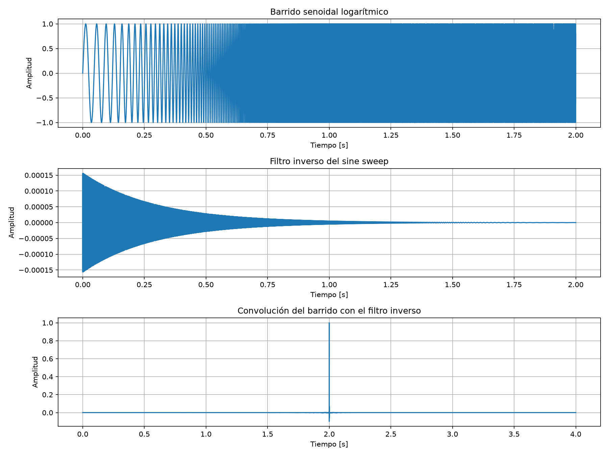

# Validación del sine sweep logarítmico — Milestone 1

## Objetivo

Verificar la generación del barrido senoidal logarítmico y su filtro inverso, implementados en app/services/sine_sweep.py, mediante pruebas automáticas y análisis gráfico.

## Fundamento Teórico

El sine sweep logarítmico es una señal de excitación cuya frecuencia aumenta exponencialmente con el tiempo.

Se utiliza en mediciones acústicas para caracterizar sistemas y obtener respuestas al impulso (RI)

El método de Farina permite recuperar la respuesta al impulso mediante la convolución de la señal registrada con un filtro inverso asociado al barrido.

En esta validación se convoluciona directamente el sweep generado con su filtro inverso, sin incluir una sala ni una cadena de reproducción y grabación.

## Parámetros utilizados

Frecuencia de muestreo: 44.100 Hz.
Duración: 2 segundos.
Frecuencia inicial: 20 Hz.
Frecuencia final: 20.000 Hz.

## Metodología

### 1. Generación del barrido

Se utiliza la función 'generate_sine_sweep_pair()' para generar el barrido senoidal logarítmico y su filtro inverso.

### 2. Verificación del filtro inverso

Se analiza la evolución temporal de la amplitud del filtro inverso, comprobando su envolvente decreciente.

### 3. Convolución

Se calcula la convolución entre el barrido generado y su filtro inverso.

El objetivo es verificar que el resultado presente una concentración de energía alrededor de un pico, aproximándose al comportamiento de un impulso.

### 4. Representación gráfica

Se generan tres gráficos:

- Barrido senoidal logarítmico.
- Filtro inverso correspondiente. 
- Resultado de la convolución entre ambas señales.

El procedimiento se encuentra implementado en 'validar_sine_sweep.py'.

## Resultados obtenidos

### Barrido Senoidal

- La frecuencia aumenta progresivamente durante los dos segundos
- La señal será normalizada entre aproximadamente -1 y +1.
- El comportamiento observado es coherente con un barrido logarítmico.

### Filtro inverso

- Presenta una envolvente de amplitud decreciente.
- Su comportamiento es coherente con la compensación utilizada en el método de Farina.

### Resultados de la convolución

- Amplitud máxima absoluta: 1,0.
- Posición del pico: muestra 88.199
- Energía relativa concentrada dentro de +/- 10 muestras del pico: Aproximadamente 98,86 %.

## Pruebas automáticas

Se ejecutaron la pruebas específicas del generador de sine sweep mediante Pytest.

Comando utilizado: 

```powershell
.\.venv\Scripts\python.exe -m pytest tests/test_generacion.py -k sine_sweep --runxfail -v
```

Resultado:

- 3 pruebas aprobadas.
- 0 pruebas fallidas.
- 6 pruebas no seleccionadas por el filtro utilizado.

Las pruebas verifican propiedades básicas de la función generadora, como el tipo de retorno, la duración y el comportamiento de frecuencia.

## Representación gráfica de la validación



La figura permite observar el incremento de frecuencia del barrido, la envolvente decreciente del filtro inverso y la concentración de energía obtenida mediante la convolución.

## Conclusión

La validación realizada muestra resultados coherentes con el funcionamiento esperado del generador de sine sweep logarítmico y su filtro inverso.

Las pruebas automáticas específicas finalizaron correctamente y la convolución produjo una respuesta concentrada alrededor de un pico de amplitud unitaria.

Esto respalda la implementación del módulo `generate_sine_sweep_pair()` correspondiente al Milestone 1.

La presente validación corresponde al procesamiento digital de las señales generadas y no constituye una medición acústica real de una sala.

## Referencia bibliográfica

Farina, A. (2000). *Simultaneous measurement of impulse response and distortion with a swept-sine technique*. 108th Audio Engineering Society Convention.
